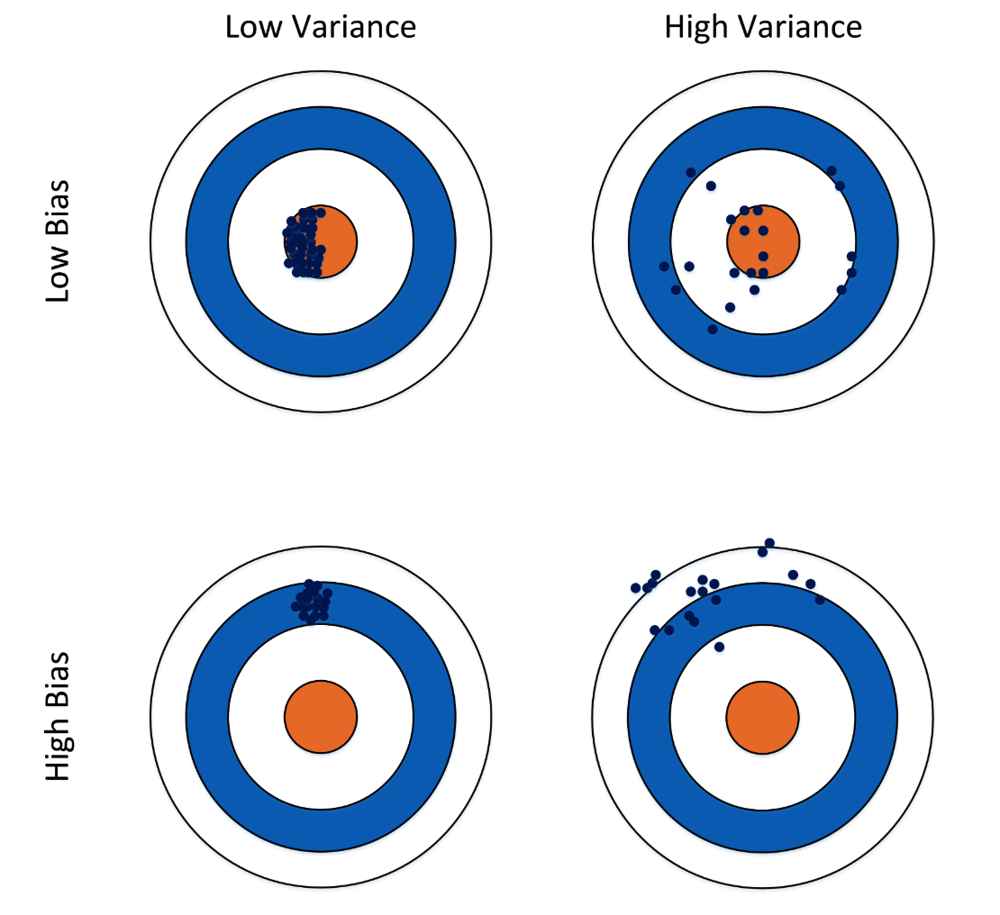
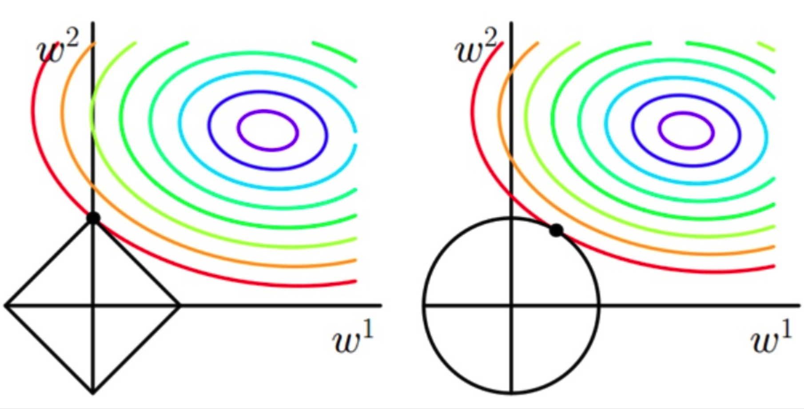
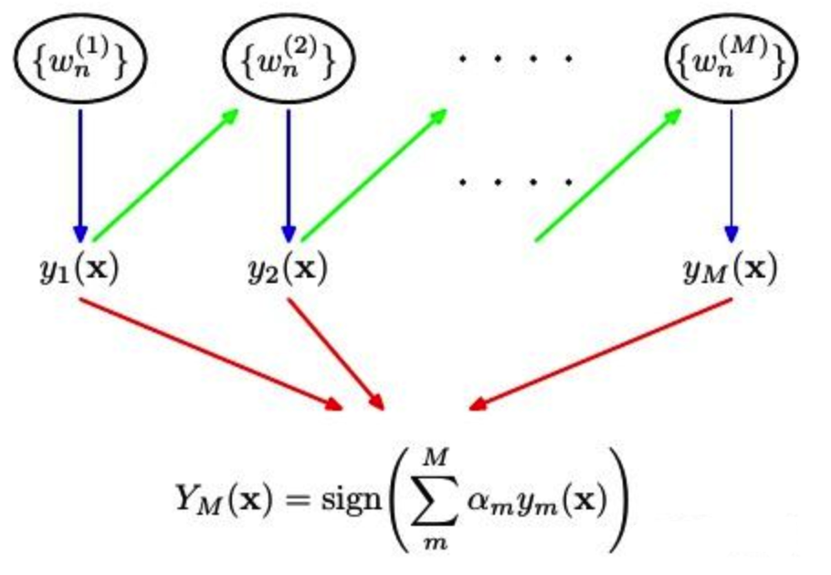
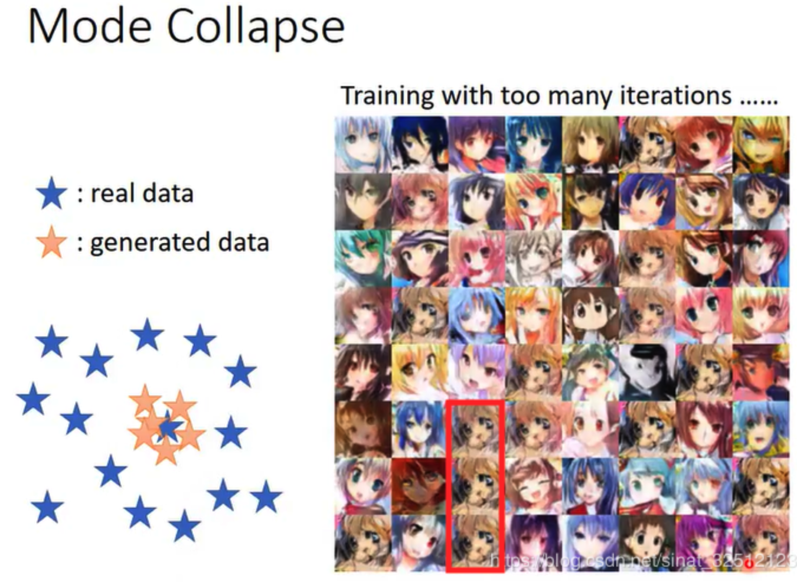

## 机器学习

1. 机器学习简介
Q: 描述机器学习的本质
A: 机器学习(Machine Learning, ML)，顾名思义，让机器去学习。这里，机器指的是计算机，是算法运行的物理载体，你也可以把各种算法本身当做一个有输入和输出的机器。那么到底让计算机去学习什么呢？对于一个任务及其表现的度量方法，设计一种算法，让算法能够提取中数据所蕴含的规律，这就叫机器学习。如果输入机器的数据是带有标签的，就称作有监督学习。如果数据是无标签的，就是无监督学习。

2. 数学知识-1
  Q: 奇异值与特征值有什么关系？
  A: 只有方阵有特征值分解，才有特征值，非方阵是奇异值分解。将一个矩阵A的转置乘以A，并对$A^TA$求特征值，则有下面的形式：
  $$
  (A^T A)V = \lambda V
  $$
  这里V就是上面的右奇异向量，另外还有：
  $$
  \sigma_i = \sqrt{\lambda_i}, u_i = \frac{1}{\sigma_i}A\mu_i
  $$
  这里的$\sigma$就是奇异值，$u$就是上面说的左奇异向量。

3. 数学知识-2

   Q: 局部最优和全局最优如何理解？

   A: 优化问题一般分为局部最优和全局最优。

   1. 局部最优，就是在函数值空间的一个有限区域内寻找最小值；而全局最优，是在函数值空间整个区域寻找最小值问题。
   2. 函数局部最小点是它的函数值小于或等于附近点的点。但是有可能大于较远距离的点。
   3. 全局最小点是那种它的函数值小于或等于所有的可行点。

   Q： 梯度下降法的缺点？

   A: 

   1. 靠近极小值时收敛速度减慢。
   2. 直线搜索时可能会产生一些问题。
   3. 可能会“之字形”地下降。

   梯度概念需注意：

   1. 梯度是一个向量，即有方向有大小。
   2. 梯度的方向是最大方向导数的方向。
   3. 梯度的值是最大方向导数的值。

   

4. 基本概念

   Q: 误差、偏差和方差有什么区别和联系？

   A: 在机器学习中，Bias(偏差)，Error(误差)，和Variance(方差)存在以下区别和联系：

   **对于Error **：

   - 误差（error）：一般地，我们把学习器的实际预测输出与样本的真是输出之间的差异称为“误差”。
   - Error = Bias + Variance + Noise，Error反映的是整个模型的准确度。

   **对于Noise:**

   噪声：描述了在当前任务上任何学习算法所能达到的期望泛化误差的下界，即刻画了学习问题本身的难度。

   **对于Bias：**

   - Bias衡量模型拟合训练数据的能力（训练数据不一定是整个 training dataset，而是只用于训练它的那一部分数据，例如：mini-batch），Bias反映的是模型在样本上的输出与真实值之间的误差，即模型本身的精准度。
   - Bias 越小，拟合能力越高（可能产生overfitting）；反之，拟合能力越低（可能产生underfitting）。
   - 偏差越大，越偏离真实数据，如下图第二行所示。

   **对于Variance：**

   - 方差公式：$S_N^w = \frac{1}{N} \sum_{i=1}^N (x_i - \hat{x})^2$

   - Variance描述的是预测值的变化范围，离散程度，也就是离其期望值的距离。方差越大，数据的分布越分散，模型的稳定程度越差。
   - Variance反映的是模型每一次输出结果与模型输出期望之间的误差，即模型的稳定性。
   - Variance越小，模型的泛化的能力越高；反之，模型的泛化的能力越低。
   - 如果模型在训练集上拟合效果比较优秀，但是在测试集上拟合效果比较差劣，则方差较大，说明模型的稳定程度较差，出现这种现象可能是由于模型对训练集过拟合造成的。 如下图所示。

   

​		Q: 什么是欠拟合和过拟合？

​		A: 模型欠拟合：在训练集以及测试集上同时具有较高的误差，此时模型的偏差较大；

​		模型过拟合：在训练集上具有较低的误差，在测试集上具有较高的误差，此时模型的方差较大。

​		模型正常：在训练集以及测试集上，同时具有相对较低的偏差以及方差。

5. 贝叶斯分类器

   Q: logistic回归与朴素贝叶斯有什么区别？

   A: 

   1. 逻辑回归是判别模型， 朴素贝叶斯是生成模型，所以生成和判别的所有区别它们都有。
   2. 朴素贝叶斯属于贝叶斯，逻辑回归是最大似然，两种概率哲学间的区别。
   3. 朴素贝叶斯需要条件独立假设。
   4. 逻辑回归需要求特征参数间是线性的。

6. 决策树

   Q: 剪枝处理的作用及策略？

   A: 

   剪枝处理是决策树学习算法用来解决过拟合问题的一种办法。

   在决策树算法中，为了尽可能正确分类训练样本， 节点划分过程不断重复， 有时候会造成决策树分支过多，以至于将训练样本集自身特点当作泛化特点， 而导致过拟合。 因此可以采用剪枝处理来去掉一些分支来降低过拟合的风险。

   剪枝的基本策略有预剪枝（pre-pruning）和后剪枝（post-pruning）。

   预剪枝：在决策树生成过程中，在每个节点划分前先估计其划分后的泛化性能， 如果不能提升，则停止划分，将当前节点标记为叶结点。

   后剪枝：生成决策树以后，再自下而上对非叶结点进行考察， 若将此节点标记为叶结点可以带来泛化性能提升，则修改之。

​		Q: 决策树算法优缺点？

​		A:

​		**决策树算法的优点**：

​		1、决策树算法易理解，机理解释起来简单。

​		2、决策树算法可以用于小数据集。

​		3、决策树算法的时间复杂度较小，为用于训练决策树的数据点的对数。

​		4、相比于其他算法智能分析一种类型变量，决策树算法可处理数字和数据的类别。

​		5、能够处理多输出的问题。

​		6、对缺失值不敏感。

​		7、可以处理不相关特征数据。

​		8、效率高，决策树只需要一次构建，反复使用，每一次预测的最大计算次数不超过决策树的深度。

​		**决策树算法的缺点**：

​		1、对连续性的字段比较难预测。

​		2、容易出现过拟合。

​		3、当类别太多时，错误可能就会增加的比较快。

​		4、在处理特征关联性比较强的数据时表现得不是太好。

​		5、对于各类别样本数量不一致的数据，在决策树当中，信息增益的结果偏向于那些具有更多数值的特征。

7. k近邻算法

   Q: 聚类和分类有什么区别 ？

   A:

   **聚类(Clustering) ** 聚类，简单地说就是把相似的东西分到一组，聚类的时候，我们并不关心某一类是什么，我们需要实现的目标只是把相似的东西聚到一起。一个聚类算法通常只需要知道如何计算相似度就可以开始工作了，因此聚类通常并不需要使用训练数据进行学习，在机器学习中属于无监督学习。

   **分类(Classification) **

    分类，对于一个分类器，通常需要你告诉它“这个东西被分为某某类”。一般情况下，一个分类器会从它得到的训练集中进行学习，从而具备对未知数据进行分类的能力，在机器学习中属于监督学习。

8. 数据降维1

   Q:课程中推到了1维的PCA结果，请推导高维的结果

   A:重构误差如下
   $$
   L = \sum_{i=1}^n ||m+ \sum_{j=1}^{d'} \alpha_{ij}e_j - x_i ||^2
   $$
   其中 $e_i$ 是标准正交基

   下面 L 对 $\alpha_{ij}$ 求偏导等于0求极值点
   $$
   \frac{\partial L}{\partial \alpha_{ij}} = 2 (\sum_{j=1}^{d'}\alpha_{ij}e_j + m - x_i)e_j^T = 0 \\
   \alpha_{ij} = e_j^T (x_i - m)
   $$
   可以得到 $\alpha_{ij}$的表达式

   下面重新计算L，并将$\alpha_{ij}$带入
   $$
   \begin{align}
   L &= \sum_{i=1}^n(\sum_{j=1}^{d'}\alpha_{ij}e_j + m - x_i)^T (\sum_{j=1}^{d'}\alpha_{ij}e_j + m - x_i) \\
   &=\sum_{i=1}^n ((\sum_{j=1}^{d'}\alpha_{ij}e_j)^T(\sum_{j=1}^{d'}\alpha_{ij}e_j) + 2(\sum_{j=1}^{d'}\alpha_{ij}e_j)^T(m-x_i) + (m-x_i)^T(m-x_i)) \\
   &= \sum_{i=1}^n \sum_{j=1}^{d'}\alpha_{ij}^2 + 2\sum_{i=1}^n ((\sum_{j=1}^{d'}\alpha_{ij}e_j)^T(m-x_i)) + \sum_{i=1}^n(m-x_i)^T(m-x_i)
   \end{align}
   $$
   把 $e_j^T (m - x_i) = -\alpha_{ij}$带入(7)
   $$
   \begin{align}
   L &= \sum_{i=1}^n \sum_{j=1}^{d'} \alpha_{ij}^2 -2 \sum_{i=1}^n \sum_{j=1}^{d'}\alpha_{ij}^2 + \sum_{i=1}^n(m-x_i)^T(m-x_i) \\
   &= -\sum_{i=1}^n\sum_{j=1}^{d'}\alpha_{ij}^2 + C
   \end{align}
   $$
   下面将 $\alpha_{ij}$ 的表达式带入(9)
   $$
   \begin{align}
   L &= -\sum_{i=1}^n\sum_{j=1}^{d'}e_j^T(x_i - m)(e_j^T(x_i - m))^T + C \\
   & = - \sum_{i=1}^n\sum_{j=1}^{d'}e_j^T(x_i - m)(x_i - m)^T e_j + C \\
   &= - \sum_{j=1}^{d'}e_j^T (\sum_{i=1}^n(x_i -m)(x_i - m)^T) e_j + C
   \end{align}
   $$
   令$\sum_{i=1}^n(x_i - m)(x_i - m)^T = S$，W 是有 $e_i$ 为列向量构成的 $n \times d'$ 的矩阵, 所以最后优化的目标是
   $$
   \min_{W} -tr(W^T S W) \\
   W^T W = I
   $$

9. 数据降维2

   Q: PCA的优缺点

   A: 

   优点：1. 仅仅需要以方差衡量信息量，不受数据集以外的因素影响。　2.各主成分之间正交，可消除原始数据成分间的相互影响的因素。3. 计算方法简单，主要运算是特征值分解，易于实现。

   缺点：1.主成分各个特征维度的含义具有一定的模糊性，不如原始样本特征的解释性强。2. 方差小的非主成分也可能含有对样本差异的重要信息，因降维丢弃可能对后续数据处理有影响。

10. 线性判别分析

    Q: LDA 和 PCA 的区别

    A: 

    相同点：

    1. 两者均可以对数据进行降维；
    2. 两者在降维时均使用了矩阵特征分解的思想；
    3. 两者都假设数据符合高斯分布；

    不同点：

    1. LDA 是有监督的降维方法，PCA 是无监督的降维方法；
    2. LDA 降维最多降到k-1维，PCA 降维多少没有限制；
    3. LDA 可以用于降维，还可以用于分类，只用于降维；
    4. LDA 选择分类性能最好的投影方向，PCA 选择样本点投影具有最大方差的方向；
    5. LDA 更明确，更能反映样本间差异，PCA 目的较为模糊；

11. 人工神经网络1

    Q: 激活函数有哪些性质

    A: 

    1. 非线性： 当激活函数是线性的，一个两层的神经网络就可以基本上逼近所有的函数。但如果激活函数是恒等激活函数的时候，即 $ f(x)=x $，就不满足这个性质，而且如果 MLP 使用的是恒等激活函数，那么其实整个网络跟单层神经网络是等价的；
    2. 可微性： 当优化方法是基于梯度的时候，就体现了该性质；
    3. 单调性： 当激活函数是单调的时候，单层网络能够保证是凸函数；
    4. $ f(x)≈x $： 当激活函数满足这个性质的时候，如果参数的初始化是随机的较小值，那么神经网络的训练将会很高效；如果不满足这个性质，那么就需要详细地去设置初始值；
    5. 输出值的范围： 当激活函数输出值是有限的时候，基于梯度的优化方法会更加稳定，因为特征的表示受有限权值的影响更显著；当激活函数的输出是无限的时候，模型的训练会更加高效，不过在这种情况小，一般需要更小的 Learning Rate。

    

12. 人工神经网络2

    Q: 如何选择激活函数？

    A: 选择一个适合的激活函数并不容易，需要考虑很多因素，通常的做法是，如果不确定哪一个激活函数效果更好，可以把它们都试试，然后在验证集或者测试集上进行评价。然后看哪一种表现的更好，就去使用它。

    以下是常见的选择情况：

    1. 如果输出是 0、1 值（二分类问题），则输出层选择 sigmoid 函数，然后其它的所有单元都选择 Relu 函数。
    2. 如果在隐藏层上不确定使用哪个激活函数，那么通常会使用 Relu 激活函数。有时，也会使用 tanh 激活函数，但 Relu 的一个优点是：当是负值的时候，导数等于 0。
    3. sigmoid 激活函数：除了输出层是一个二分类问题基本不会用它。
    4. tanh 激活函数：tanh 是非常优秀的，几乎适合所有场合。
    5. ReLu 激活函数：最常用的默认函数，如果不确定用哪个激活函数，就使用 ReLu 或者 Leaky ReLu，再去尝试其他的激活函数。
    6. 如果遇到了一些死的神经元，我们可以使用 Leaky ReLU 函数。

    

13. 人工神经网络3

    Q: 为什么需要 Batch_Size？

    A: Batch的选择，首先决定的是下降的方向。

    如果数据集比较小，可采用全数据集的形式，好处是：

    1. 由全数据集确定的方向能够更好地代表样本总体，从而更准确地朝向极值所在的方向。
    2. 由于不同权重的梯度值差别巨大，因此选取一个全局的学习率很困难。 Full Batch Learning 可以使用 Rprop 只基于梯度符号并且针对性单独更新各权值。

    对于更大的数据集，假如采用全数据集的形式，坏处是：

    1. 随着数据集的海量增长和内存限制，一次性载入所有的数据进来变得越来越不可行。
    2. 以 Rprop 的方式迭代，会由于各个 Batch 之间的采样差异性，各次梯度修正值相互抵消，无法修正。这才有了后来 RMSProp 的妥协方案。

14. 支持向量机1

    Q: SVM主要缺点

    A: 

    (1) SVM算法对大规模训练样本难以实施
    ​ SVM的空间消耗主要是存储训练样本和核矩阵，由于SVM是借助二次规划来求解支持向量，而求解二次规划将涉及m阶矩阵的计算（m为样本的个数），当m数目很大时该矩阵的存储和计算将耗费大量的机器内存和运算时间。
    ​ 如果数据量很大，SVM的训练时间就会比较长，如垃圾邮件的分类检测，没有使用SVM分类器，而是使用简单的朴素贝叶斯分类器，或者是使用逻辑回归模型分类。

    (2) 用SVM解决多分类问题存在困难

     经典的支持向量机算法只给出了二类分类的算法，而在实际应用中，一般要解决多类的分类问题。可以通过多个二类支持向量机的组合来解决。主要有一对多组合模式、一对一组合模式和SVM决策树；再就是通过构造多个分类器的组合来解决。主要原理是克服SVM固有的缺点，结合其他算法的优势，解决多类问题的分类精度。如：与粗糙集理论结合，形成一种优势互补的多类问题的组合分类器。

    (3) 对缺失数据敏感，对参数和核函数的选择敏感

     支持向量机性能的优劣主要取决于核函数的选取，所以对于一个实际问题而言，如何根据实际的数据模型选择合适的核函数从而构造SVM算法。目前比较成熟的核函数及其参数的选择都是人为的，根据经验来选取的，带有一定的随意性。在不同的问题领域，核函数应当具有不同的形式和参数，所以在选取时候应该将领域知识引入进来，但是目前还没有好的方法来解决核函数的选取问题。

    

15. 支持向量机2

    Q: 核函数特点及其作用？

    A: 引入核函数目的：把原坐标系里线性不可分的数据用核函数Kernel投影到另一个空间，尽量使得数据在新的空间里线性可分。
    ​	核函数方法的广泛应用，与其特点是分不开的：

    1）核函数的引入避免了“维数灾难”，大大减小了计算量。而输入空间的维数n对核函数矩阵无影响。因此，核函数方法可以有效处理高维输入。

    2）无需知道非线性变换函数Φ的形式和参数。

    3）核函数的形式和参数的变化会隐式地改变从输入空间到特征空间的映射，进而对特征空间的性质产生影响，最终改变各种核函数方法的性能。

    4）核函数方法可以和不同的算法相结合，形成多种不同的基于核函数技术的方法，且这两部分的设计可以单独进行，并可以为不同的应用选择不同的核函数和算法。

16. 支持向量机3

    Q: SVM为什么引入对偶问题?

    A: 

    1，对偶问题将原始问题中的约束转为了对偶问题中的等式约束，对偶问题往往更加容易求解。

    2，可以很自然的引用核函数（拉格朗日表达式里面有内积，而核函数也是通过内积进行映射的）。

    3，对偶问题有非常良好的性质，以下列举几个：

    ​	a, 对偶问题的对偶是原问题；

    ​	b, 无论原始问题是否是凸的，对偶问题都是凸优化问题；

    ​	c, 对偶问题可以给出原始问题一个下界；

    ​	d, 当满足一定条件时，原始问题与对偶问题的解是完全等价的。

17. 线性模型1

    Q: 逻辑回归适用性

    A: 逻辑回归可用于以下几个方面：

    （1）用于概率预测。用于可能性预测时，得到的结果有可比性。比如根据模型进而预测在不同的自变量情况下，发生某病或某种情况的概率有多大。

    （2）用于分类。实际上跟预测有些类似，也是根据模型，判断某人属于某病或属于某种情况的概率有多大，也就是看一下这个人有多大的可能性是属于某病。进行分类时，仅需要设定一个阈值即可，可能性高于阈值是一类，低于阈值是另一类。

    （3）寻找危险因素。寻找某一疾病的危险因素等。

    （4）仅能用于线性问题。只有当目标和特征是线性关系时，才能用逻辑回归。在应用逻辑回归时注意两点：一是当知道模型是非线性时，不适用逻辑回归；二是当使用逻辑回归时，应注意选择和目标为线性关系的特征。

    （5）各特征之间不需要满足条件独立假设，但各个特征的贡献独立计算。

    

18. 线性模型2

    Q: L1 正则化和 L2 正则化的区别与联系

    A: 

    L1 正则化和 L2 正则化都可以通过降低模型复杂度，得到更小的泛化误差，降低过拟合程度。

    但是 L1 正则化和 L2 正则化不同的是，L1 正则化能够提供更多的稀疏性。

    

    

19. 随机森林

    Q: 随机森林的优缺点

    A:

    随机森林的优点：

    - 表现性能好，与其他算法相比有着很大优势。

    - 随机森林能处理很高维度的数据（也就是很多特征的数据），并且不用做特征选择。

    - 在训练完之后，随机森林能给出哪些特征比较重要。

    - 训练速度快，容易做成并行化方法(训练时，树与树之间是相互独立的)。

    - 在训练过程中，能够检测到feature之间的影响。

    - 对于不平衡数据集来说，随机森林可以平衡误差。当存在分类不平衡的情况时，随机森林能提供平衡数据集误差的有效方法。

    - 如果有很大一部分的特征遗失，用RF算法仍然可以维持准确度。

    - 随机森林算法有很强的抗干扰能力（具体体现在6,7点）。所以当数据存在大量的数据缺失，用RF也是不错的。

    - 随机森林抗过拟合能力比较强（虽然理论上说随机森林不会产生过拟合现象，但是在现实中噪声是不能忽略的，增加树虽然能够减小过拟合，但没有办法完全消除过拟合，无论怎么增加树都不行，再说树的数目也不可能无限增加的。）

      在创建随机森林时候，对generlization error(泛化误差)使用的是无偏估计模型，泛化能力强。

    随机森林的缺点：

    - 随机森林在解决回归问题时，并没有像它在分类中表现的那么好，这是因为它并不能给出一个连续的输出。当进行回归时，随机森林不能够做出超越训练集数据范围的预测，这可能导致在某些特定噪声的数据进行建模时出现过度拟合。（PS:随机森林已经被证明在某些噪音较大的分类或者回归问题上回过拟合）。
    - 对于许多统计建模者来说，随机森林给人的感觉就像一个黑盒子，你无法控制模型内部的运行。只能在不同的参数和随机种子之间进行尝试。
    - 可能有很多相似的决策树，掩盖了真实的结果。
    - 对于小数据或者低维数据（特征较少的数据），可能不能产生很好的分类。（处理高维数据，处理特征遗失数据，处理不平衡数据是随机森林的长处）。
    - 执行数据虽然比boosting等快（随机森林属于bagging），但比单只决策树慢多了。

20. Adabbost算法1

    Q: AdaBoost原理概述

    A: 

    AdaBoost的具体流程为先对每个样本赋予相同的初始权重，每一轮学习器训练过后都会根据其表现对每个样本的权重进行调整，增加分错样本的权重，这样先前做错的样本在后续就能得到更多关注，按这样的过程重复训练出M个学习器，最后进行加权组合，如下图所示。

    

21. Adaboost算法2

    Q：Adaboost 的优点和缺点？

    A: 优点：

    1）adaboost是一种有很高精度的分类器。
    2）可以使用各种方法构建子分类器，Adaboost算法提供的是框架。
    3）当使用简单分类器时，计算出的结果是可以理解的。而且弱分类器构造极其简单。
    4）简单，不用做特征筛选。
    5）不用担心overfitting。

    缺点：

    对异常样本敏感，异常样本在迭代中可能会获得较高的权重，影响最终的强学习器的预测准确性。

22. Adaboost算法3

    Q: 

    A:若将指数损失表示为期望值的形式：
    $$
    E\left(e^{-y f(x)} | x\right)=P(y=1 | x) e^{-f(x)}+P(y=-1 | x) e^{f(x)}
    $$
    由于是最小化指数损失，则将上式求导并令其为0：

    
    $$
    \frac{\partial E\left(e^{-y f(x)} | x\right)}{\partial f(x)}=-P(y=1 | x) e^{-f(x)}+P(y=-1 | x) e^{f(x)}=0
    $$
    $f(x)=\frac{1}{2} \log \frac{P(y=1 | x)}{P(y=-1 | x)}$ 或写成 $P(y=1 | x)=\frac{1}{1+e^{-2 f(x)}}$

    这不就是logistic regression吗？二者只差系数 ![[公式]](https://www.zhihu.com/equation?tex=%5Cfrac12) ，因此每一轮最小化指数损失其实就是在训练一个logistic regression模型，以逼近对数几率 (log odds)。

    于是
    $$
    \begin{align}
    \operatorname{sign}(f(x)) &=\operatorname{sign}\left(\frac{1}{2} \log \frac{P(y=1 | x)}{P(y=-1 | x)}\right) \\
    &=\left\{\begin{array}{cc}{1} & {P(y=1 | x)>p(y=-1 | x)} \\ {-1} & {P(y=1 | x)<P(y=-1 | x)}\end{array}\right. \\
    &=\underset{y \in\{-1,1\}}{\arg \max } P(y | x)
    \end{align}
    $$
    这意味着 ![[公式]](https://www.zhihu.com/equation?tex=sign%28f%28x%29%29) 达到了贝叶斯最优错误率，即对于每个样本 ![[公式]](https://www.zhihu.com/equation?tex=x) 都选择后验概率最大的类别。

23. 高斯混合模型和EM算法

    Q:  EM算法流程

    A: 

    输入：观察数据$x=(x^{(1)},x^{(2)},...x^{(m)})$，联合分布$p(x,z ;\theta)$，条件分布$p(z|x; \theta)$，最大迭代次数$J$

    1）随机初始化模型参数$\theta$的初值$\theta^0$。

    2）$for \ j \ from \ 1 \ to \ j$：

    ​	a） E步。计算联合分布的条件概率期望： $$ Q_i(z^{(i)}) = P( z^{(i)}|x^{(i)}, \theta^{j}) $$

    $$ L(\theta, \theta^{j}) = \sum\limits_{i=1}^m\sum\limits_{z^{(i)}}P( z^{(i)}|x^{(i)}, \theta^{j})log{P(x^{(i)}, z^{(i)};\theta)} $$

    ​	b） M步。极大化$L(\theta, \theta^{j})$，得到$\theta^{j+1}$: $$ \theta^{j+1} = \mathop{\arg\max}_\theta L(\theta, \theta^{j}) $$ 	c） 如果$\theta^{j+1}$收敛，则算法结束。否则继续回到步骤a）进行E步迭代。

    输出：模型参数$\theta$。

    

24.  聚类算法1

    Q: 聚类和降维有什么区别与联系?

    A:

    聚类用于找寻数据内在的分布结构，既可以作为一个单独的过程，比如异常检测等等。也可作为分类等其他学习任务的前驱过程。聚类是标准的无监督学习。而降维则是为了缓解维数灾难的一个重要方法，就是通过某种数学变换将原始高维属性空间转变为一个低维“子空间”。他们虽然都能实现对数据的约减，但是二者适用的对象不同，聚类针对的是数据点，而降维则是对于数据的特征。另外它们有着很多种实现方法。聚类中常用的有K-means、层次聚类、基于密度的聚类等；降维中常用的则PCA、Isomap、LLE等。

    

25. 聚类算法2

    Q: 聚类和分类有什么区别？

    A:

    **聚类（Clustering）**，简单地说就是把相似的东西分到一组，聚类的时候，我们并不关心某一类是什么，我们需要实现的目标只是把相似的东西聚到一起。一个聚类算法通常只需要知道如何计算相似度就可以开始工作了，因此聚类通常并不需要使用训练数据进行学习，在机器学习中属于无监督学习。

    **分类（Classification） **，对于一个分类器，通常需要你告诉它“这个东西被分为某某类”。一般情况下，一个分类器会从它得到的训练集中进行学习，从而具备对未知数据进行分类的能力，在机器学习中属于监督学习。

    ### 

26. 隐马尔科夫模型

    Q: 什么样的问题需要HMM模型？

    A: 使用HMM模型时我们的问题一般有这两个特征：１）我们的问题是基于序列的，比如时间序列，或者状态序列。２）我们的问题中有两类数据，一类序列数据是可以观测到的，即观测序列；而另一类数据是不能观察到的，即隐藏状态序列，简称状态序列。

    　　有了这两个特征，那么这个问题一般可以用HMM模型来尝试解决。这样的问题在实际生活中是很多的。比如：我现在在打字写博客，我在键盘上敲出来的一系列字符就是观测序列，而我实际想写的一段话就是隐藏序列，输入法的任务就是从敲入的一系列字符尽可能的猜测我要写的一段话，并把最可能的词语放在最前面让我选择，这就可以看做一个HMM模型了。再举一个，我在和你说话，我发出的一串连续的声音就是观测序列，而我实际要表达的一段话就是状态序列，你大脑的任务，就是从这一串连续的声音中判断出我最可能要表达的话的内容。

    　　从这些例子中，我们可以发现，HMM模型可以无处不在。但是上面的描述还不精确，下面我们用精确的数学符号来表述我们的HMM模型。

    

27. 强化学习

    Q: 强化学习和监督学习的区别？

    A: 监督式学习就好比你在学习的时候，有一个导师在旁边指点，他知道怎么是对的怎么是错的，而强化学习会在没有任何标签的情况下，通过先尝试做出一些行为得到一个结果，通过这个结果是对还是错的反馈，调整之前的行为，就这样不断的调整，算法能够学习到在什么样的情况下选择什么样的行为可以得到最好的结果。

29. 工程实践

    Q: 在inference阶段，如何将BN层的参数和在之前的Linear或Conv层中，加速推断时间（因为二者都是线性变换）

    A: 当网络训练完成, 在推导的时候为了加速运算, 通常将卷积层和 batch-norm 层融合, 原理如下
    $$
    \begin{aligned} y_{c o n v} &=w \cdot x+b \\ y_{b n} &=\gamma \cdot\left(\frac{y_{c o n v}-E[x]}{\sqrt{\operatorname{Var}[x]+\epsilon}}\right)+\beta \\ &=\gamma \cdot\left(\frac{w x+b-E[x]}{\sqrt{\operatorname{Var}[x]+\epsilon}}\right)+\beta \\ \hat{w} &=\frac{\gamma}{\sqrt{\operatorname{Var}[x]+\epsilon} \cdot w} \\ \hat{b} &=\frac{\gamma}{\sqrt{\operatorname{Var}[x]+\epsilon}} \cdot(b-E[x])+\beta \\ y_{b n} &=\hat{w} \cdot x+\hat{b} \end{aligned}
    $$
    

    

---

## 深度学习

1. 机器学习与数学基础知识

   Q: 如何解决过拟合与欠拟合？

   A: **如何解决欠拟合：**

   1. 添加其他特征项。组合、泛化、相关性、上下文特征、平台特征等特征是特征添加的重要手段，有时候特征项不够会导致模型欠拟合。
   2. 添加多项式特征。例如将线性模型添加二次项或三次项使模型泛化能力更强。例如，FM（Factorization Machine）模型、FFM（Field-aware Factorization Machine）模型，其实就是线性模型，增加了二阶多项式，保证了模型一定的拟合程度。
   3. 可以增加模型的复杂程度。
   4. 减小正则化系数。正则化的目的是用来防止过拟合的，但是现在模型出现了欠拟合，则需要减少正则化参数。

   **如何解决过拟合：**

   1. 重新清洗数据，数据不纯会导致过拟合，此类情况需要重新清洗数据。
   2. 增加训练样本数量。
   3. 降低模型复杂程度。
   4. 增大正则项系数。
   5. 采用dropout方法，dropout方法，通俗的讲就是在训练的时候让神经元以一定的概率不工作。
   6. early stopping。
   7. 减少迭代次数。
   8. 增大学习率。
   9. 添加噪声数据。
   10. 树结构中，可以对树进行剪枝。
   11. 减少特征项。

   欠拟合和过拟合这些方法，需要根据实际问题，实际模型，进行选择。

​		Q: 交叉验证的主要作用？

​		A: 为了得到更为稳健可靠的模型，对模型的泛化误差进行评估，得到模型泛化误差的近似值。当有多个模型	可以选择时，我们通常选择“泛化误差”最小的模型。

​		交叉验证的方法有许多种，但是最常用的是：留一交叉验证、k折交叉验证。

2. 人工神经网络1

   Q: 深度学习和机器学习有什么不同？

   A: **机器学习**：利用计算机、概率论、统计学等知识，输入数据，让计算机学会新知识。机器学习的过程，就是训练数据去优化目标函数。

   ​	**深度学习**：是一种特殊的机器学习，具有强大的能力和灵活性。它通过学习将世界表示为嵌套的层次结构，每个表示都与更简单的特征相关，而抽象的表示则用于计算更抽象的表示。

   ​	传统的机器学习需要定义一些手工特征，从而有目的的去提取目标信息， 非常依赖任务的特异性以及设计特征的专家经验。而深度学习可以从大数据中先学习简单的特征，并从其逐渐学习到更为复杂抽象的深层特征，不依赖人工的特征工程，这也是深度学习在大数据时代受欢迎的一大原因。

   

3. 人工神经网络2

   Q: 为什么需要非线性激活函数？

   A: **为什么需要激活函数？**

   1. 激活函数对模型学习、理解非常复杂和非线性的函数具有重要作用。
   2. 激活函数可以引入非线性因素。如果不使用激活函数，则输出信号仅是一个简单的线性函数。线性函数一个一级多项式，线性方程的复杂度有限，从数据中学习复杂函数映射的能力很小。没有激活函数，神经网络将无法学习和模拟其他复杂类型的数据，例如图像、视频、音频、语音等。
   3. 激活函数可以把当前特征空间通过一定的线性映射转换到另一个空间，让数据能够更好的被分类。

     **为什么激活函数需要非线性函数？**

   1. 假若网络中全部是线性部件，那么线性的组合还是线性，与单独一个线性分类器无异。这样就做不到用非线性来逼近任意函数。
   2. 使用非线性激活函数 ，以便使网络更加强大，增加它的能力，使它可以学习复杂的事物，复杂的表单数据，以及表示输入输出之间非线性的复杂的任意函数映射。使用非线性激活函数，能够从输入输出之间生成非线性映射。

   

   Q: 使用 ReLu 激活函数的优点？

   1. 在区间变动很大的情况下，ReLu 激活函数的导数或者激活函数的斜率都会远大于 0，在程序实现就是一个 if-else 语句，而 sigmoid 函数需要进行浮点四则运算，在实践中，使用 ReLu 激活函数神经网络通常会比使用 sigmoid 或者 tanh 激活函数学习的更快。
   2. sigmoid 和 tanh 函数的导数在正负饱和区的梯度都会接近于 0，这会造成梯度弥散，而 Relu 和Leaky ReLu 函数大于 0 部分都为常数，不会产生梯度弥散现象。
   3. 需注意，Relu 进入负半区的时候，梯度为 0，神经元此时不会训练，产生所谓的稀疏性，而 Leaky ReLu 不会产生这个问题。

4. 深度学习简介

   Q: 为什么深层神经网络难以训练？

   A: 

   1. **梯度消失**是指通过隐藏层从后向前看，梯度会变的越来越小，说明前面层的学习会显著慢于后面层的学习，所以学习会卡住，除非梯度变大。

      梯度消失的原因受到多种因素影响，例如学习率的大小，网络参数的初始化，激活函数的边缘效应等。在深层神经网络中，每一个神经元计算得到的梯度都会传递给前一层，较浅层的神经元接收到的梯度受到之前所有层梯度的影响。如果计算得到的梯度值非常小，随着层数增多，求出的梯度更新信息将会以指数形式衰减，就会发生梯度消失。

   2. **梯度爆炸** 在深度网络或循环神经网络（Recurrent Neural Network, RNN）等网络结构中，梯度可在网络更新的过程中不断累积，变成非常大的梯度，导致网络权重值的大幅更新，使得网络不稳定；在极端情况下，权重值甚至会溢出，变为$NaN$值，再也无法更新。

   3. **权重矩阵的退化** 导致模型的有效自由度减少。

      参数空间中学习的退化速度减慢，导致减少了模型的有效维数，网络的可用自由度对学习中梯度范数的贡献不均衡，随着相乘矩阵的数量（即网络深度）的增加，矩阵的乘积变得越来越退化。在有硬饱和边界的非线性网络中（例如 ReLU 网络），随着深度增加，退化过程会变得越来越快。

5. 自动编码器

   Q: 为什么无监督预训练可以帮助深度学习？

   A:

   深度网络存在问题:

   1. 网络越深，需要的训练样本数越多。若用监督则需大量标注样本，不然小规模样本容易造成过拟合。深层网络特征比较多，会出现的多特征问题主要有多样本问题、规则化问题、特征选择问题。
   2. 多层神经网络参数优化是个高阶非凸优化问题，经常得到收敛较差的局部解；
   3. 梯度扩散问题，BP算法计算出的梯度随着深度向前而显著下降，导致前面网络参数贡献很小，更新速度慢。

   逐层贪婪训练，无监督预训练（unsupervised pre-training）即训练网络的第一个隐藏层，再训练第二个…最后用这些训练好的网络参数值作为整体网络参数的初始值。

   经过预训练最终能得到比较好的局部最优解。

6. 受限玻尔兹曼机

   Q: 神经网络使用深层表示有什么好处？

   A:

   1. 深度神经网络是一种特征递进式的学习算法，浅层的神经元直接从输入数据中学习一些低层次的简单特征，例如边缘、纹理等。而深层的特征则基于已学习到的浅层特征继续学习更高级的特征，从计算机的角度学习深层的语义信息。
   2. 深层的网络隐藏单元数量相对较少，隐藏层数目较多，如果浅层的网络想要达到同样的计算结果则需要指数级增长的单元数量才能达到。

7. 卷积神经网络1

   Q: 卷积层和池化层有什么区别？

   A: 

   |            | 卷积层                                 | 池化层                           |
   | ---------- | -------------------------------------- | -------------------------------- |
   | **结构**   | 零填充时输出维度不变，而通道数改变     | 通常特征维度会降低，通道数不变   |
   | **稳定性** | 输入特征发生细微改变时，输出结果会改变 | 感受域内的细微变化不影响输出结果 |
   | **作用**   | 感受域内提取局部关联特征               | 感受域内提取泛化特征，降低维度   |
   | **参数量** | 与卷积核尺寸、卷积核个数相关           | 不引入额外参数                   |

8. 卷积神经网络2

   Q: $1 \times 1$ 卷积的作用

   A: 

   1. 实现信息的跨通道交互和整合;

   2. 对卷积核通道数进行降维和升维，减小参数量。

   

9. 卷积神经网络3

   Q: 怎样才能减少卷积层参数量？

   A:

   减少卷积层参数量的方法可以简要地归为以下几点：

   1. 使用堆叠小卷积核代替大卷积核：VGG网络中2个$3\times 3$的卷积核可以代替1个$5\times 5$的卷积核
   2. 使用分离卷积操作：将原本$K\times K\times C$的卷积操作分离为$K\times K\times 1$和$1\times1\times C$的两部分操作

   3. 添加$1\times 1$的卷积操作：与分离卷积类似，但是通道数可变，在$K\times K\times C_1$卷积前添加$1\times1\times C_2$的卷积核（满足$C_2 <C_1$）

   4. 在卷积层前使用池化操作：池化可以降低卷积层的输入特征维度

10. 卷积神经网络4

    Q: 什么是类别不均衡（class imbalance）？

    A: 负样本的数量极大于正样本的数量，比如包含物体的区域（正样本）很少，而不包含物体的区域（负样本）很多。比如检测算法在早期会生成一大波的bbox。而一幅常规的图片中，顶多就那么几个object。这意味着，绝大多数的bbox属于background。

​		Q: 样本的类别不均衡会带来什么问题？

​		A: 由于大多数都是简单易分的负样本（属于背景的样本），使得训练过程不能充分学习到属于那些有类别样		本的信息；其次简单易分的负样本太多，可能掩盖了其他有类别样本的作用（这些简单易分的负样本仍产生		一定幅度的loss，见下图蓝色曲线，数量多会对loss起主要贡献作用，因此就主导了梯度的更新方向，掩盖了		重要的信息）。简单来说，因为bbox数量爆炸。 正是因为bbox中属于background的bbox太多了，所以如果		分类器无脑地把所有bbox统一归类为background，accuracy也可以刷得很高。于是乎，分类器的训练就失		败了。分类器训练失败，检测精度自然就低了。

11. 卷积神经网络5

    Q: 为什么在two-stage检测器中，没有出现类别不均衡（class imbalamce）问题呢？

    A: 因为通过RPN阶段可以减少候选目标区域，而在分类阶段，可以固定前景与背景比值（foreground-to-background ratio）为1:3，或者使用OHEM（online hard example mining）使得前景和背景的数量达到均衡。

    

12. 循环神经网络1

    Q: CNN和RNN的区别？

    A: 

    |  类别  | 特点描述                                                     |
    | :----: | ------------------------------------------------------------ |
    | 相同点 | 1、传统神经网络的扩展。 2、前向计算产生结果，反向计算模型更新。 3、每层神经网络横向可以多个神经元共存,纵向可以有多层神经网络连接。 |
    | 不同点 | 1、CNN空间扩展，神经元与特征卷积；RNN时间扩展，神经元与多个时间输出计算 2、RNN可以用于描述时间上连续状态的输出，有记忆功能，CNN用于静态输出 |

13. 循环神经网络2

    Q:  RNNs训练和传统ANN训练异同点？

    A: 

    **相同点**：

    1. RNNs与传统ANN都使用BP（Back Propagation）误差反向传播算法。

    **不同点**：

    1. RNNs网络参数W,U,V是共享的(具体在本章6.2节中已介绍)，而传统神经网络各层参数间没有直接联系。
    2. 对于RNNs，在使用梯度下降算法中，每一步的输出不仅依赖当前步的网络，还依赖于之前若干步的网络状态。

14. 循环神经网络3

    Q: 为什么RNN 训练的时候Loss波动很大

    A: 由于RNN特有的memory会影响后期其他的RNN的特点，梯度时大时小，learning rate没法个性化的调整，导致RNN在train的过程中，Loss会震荡起伏，为了解决RNN的这个问题，在训练的时候，可以设置临界值，当梯度大于某个临界值，直接截断，用这个临界值作为梯度的大小，防止大幅震荡。

    

15. 循环神经网络4

    Q: 如何解决RNN中的梯度消失问题？

    A: 解决RNN中的梯度消失方法主要有：

    ​	1、选取更好的激活函数，如Relu激活函数。ReLU函数的左侧导数为0，右侧导数恒为1，这就避免了“梯度消失“的发生。但恒为1的导数容易导致“梯度爆炸“，但设定合适的阈值可以解决这个问题。

    ​	2、加入BN层，其优点包括可加速收敛、控制过拟合，可以少用或不用Dropout和正则、降低网络对初始化权重不敏感，且能允许使用较大的学习率等。

    ​	3、改变传播结构，LSTM结构可以有效解决这个问题。

16. 生成对抗网络1

    Q: 什么是mode collapsing？

    A: 某个模式(mode)出现大量重复样本，例如： 

    

    上图左侧的蓝色五角星表示真实样本空间，黄色的是生成的。生成样本缺乏多样性，存在大量重复。比如上图右侧中，红框里面人物反复出现。

    

17. 生成对抗网络2

    Q: GAN的Loss为什么降不下去？

    A:

    对于很多GAN的初学者在实践过程中可能会纳闷，为什么GAN的Loss一直降不下去。GAN到底什么时候才算收敛？其实，作为一个训练良好的GAN，其Loss就是降不下去的。衡量GAN是否训练好了，只能由人肉眼去看生成的图片质量是否好。不过，对于没有一个很好的评价是否收敛指标的问题，也有许多学者做了一些研究，后文提及的WGAN就提出了一种新的Loss设计方式，较好的解决了难以判断收敛性的问题。下面我们分析一下GAN的Loss为什么降不下去？ 对于判别器而言，GAN的Loss如下： 

    $$ \mathop {\min }\limits_G \mathop {\max }\limits_D V(D,G) = {\rm E}*{x\sim{p*{data}(x)}}[\log D(x)] + {\rm E}_{z\sim{p_z}(z)}[\log (1 - D(G(z)))] $$ 	

    从$\mathop {\min }\limits_G \mathop {\max }\limits_D V(D,G)$可以看出，生成器和判别器的目的相反，也就是说两个生成器网络和判别器网络互为对抗，此消彼长。不可能Loss一直降到一个收敛的状态。

    - 对于生成器，其Loss下降快，很有可能是判别器太弱，导致生成器很轻易的就"愚弄"了判别器。
    - 对于判别器，其Loss下降快，意味着判别器很强，判别器很强则说明生成器生成的图像不够逼真，才使得判别器轻易判别，导致Loss下降很快。

    也就是说，无论是判别器，还是生成器。loss的高低不能代表生成器的好坏。一个好的GAN网络，其GAN Loss往往是不断波动的。

    

18. 深度强化学习1

    Q: 强化学习的主要特点

    A:

    其他许多机器学习算法中学习器都是学得怎样做，而RL是在尝试的过程中学习到在特定的情境下选择哪种行动可以得到最大的回报。在很多场景中，当前的行动不仅会影响当前的rewards，还会影响之后的状态和一系列的rewards。RL最重要的3个特定在于： (1)	基本是以一种闭环的形式； (2)	不会直接指示选择哪种行动（actions）； (3)	一系列的actions和奖励信号（reward signals）都会影响之后较长的时间。

19. 深度强化学习2

    Q: 强化学习和监督学习的区别？

    A: 监督式学习就好比你在学习的时候，有一个导师在旁边指点，他知道怎么是对的怎么是错的，而强化学习会在没有任何标签的情况下，通过先尝试做出一些行为得到一个结果，通过这个结果是对还是错的反馈，调整之前的行为，就这样不断的调整，算法能够学习到在什么样的情况下选择什么样的行为可以得到最好的结果。

    

20. 深度强化学习3

    Q: model-based 和 model-free 的区别？

    A: model-free, 是agent和environment进行实时的交互；而 model-based，从名字上我们就能感受到的到，是先根据真实的情况先学得一个model，即比model-free多了一个对真实世界建模。